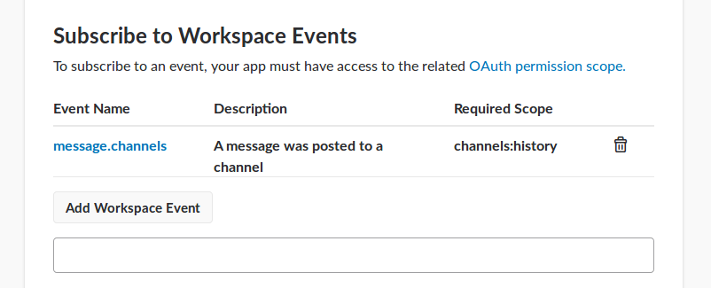

# Slack botti

Kurssille Ohjelmistotekniikan menetelmät.

# Dokumentaatio 

[Vaatimusmäärittely](/dokumentaatio/vaatimusmaarittely.md)

[Testaus](/dokumentaatio/testaus.md)

# Ohjelman asentaminen ja käyttäminen

Tämä ohjelma on ohjelmoitu Pythonilla versio 3.6.3

Tarkista oma python versio komennolla `python -V` tai `python3 -V`

Ohjelman käyttämiseen tarvitset tunnukset Slack palveluun ja oman työtilan jonne voit asentaan tämän sovelluksen.

Avaa internet selain ja mene osoitteeseen https://slack.com/ ja paina nappia Create Workspace. Seuraa ohjeita kunnes olet tehnyt tunnkset sekä työtilan.

Lataa ja asenna ngrok ohjelma https://ngrok.com/

Käynnistä ngrok porttiin 3000

`lauri@ubuntu-pc:~$ ./ngrok http 3000`


Kloonaa tämä git repository omalle koneelle. Siirry kansioon slack-bot ja tee uusi virtuaaliympäristö ja aktivoi se.

`lauri@ubuntu-pc:~/slackbot/otm-harjoitustyo/slack-bot$ python -m venv venv`

`lauri@ubuntu-pc:~/slackbot/otm-harjoitustyo/slack-bot$ source venv/bin/activate`

`(venv) lauri@ubuntu-pc:~/slackbot/otm-harjoitustyo/slack-bot$`

lataa vaadittavat lisäosat pip ohjelman avulla

`(venv) lauri@ubuntu-pc:~/slackbot/otm-harjoitustyo/slack-bot$ pip install -r requirements.txt`

Käynnistä ohjelma 

`(venv) lauri@ubuntu-pc:~/slackbot/otm-harjoitustyo/slack-bot$ python run.py`

Kun käynnistät ohjelman ensinmäistä kertaa terminaaliin pitäisi tulostua seuraavanlainen viesti:

```(venv) lauri@ubuntu-pc:~/otmt/otm-harjoitustyo/slack-bot$ python run.py


PLEASE SET BOT_OAUTH ENVIRONMENT VARIABLE CORRECTLY


PLEASE SET SLACK_OAUTH ENVIRONMENT VARIABLE CORRECTLY


 * Running on http://127.0.0.1:3000/ (Press CTRL+C to quit)
```


Seuraavaksi tehdään uusi Slack App. Mene osoitteeseen https://api.slack.com/apps?new_app=1 ja valitse haluamasi nimi ja työtila.


Siirry valikosta kohtaan Event Subscriptions. Kopioi ngrok ohjelmasta saamasi osoite kohtaan Request URL. Tekstikentän päälle pitäisi ilmestyä teksti Verified. Jos siihen ilmestyi Your URL didn't respond with the value of the challenge parameter. Varmista että ohjelma on käynnissä.


Alempaa sivu löytyy osio Subscribe to Workspace Events. Paina Add Workspace Event ja valitse messages.channel

]

Paina save changes ja siirry valikosta kohtaan Bot Users. Paina Add a Bot User. Valitse botille nimi ja paina Add Bot User.


Siirry valikkoon Interactive Components. Kopioi ngrok ohjelmasta saamasi osoite kenttään Request URL ja lisää sen perään /component


Paina Enable Interactive Components ja siirry OAuth & Permissions valikkoon. Valitse Select Permission Scopes valikosta kohta files:read 


Paina Save Changes ja siirry sivua ylöspäin ja paina Install App to Workspace. Sammuta ohjelma painamalla ctrl + c. Lisätään OAuth Access Token ympäristömuuttujaksi komennolla 

`(venv) lauri@ubuntu-pc:~/slackbot/otm-harjoitustyo/slack-bot$ export SLACK_OAUTH=tähän-sinun-oauth-token`


Lisätään Bot User OAuth Access Token myös ympäristömuuttujaksi

`(venv) lauri@ubuntu-pc:~/slackbot/otm-harjoitustyo/slack-bot$ export BOT_OAUTH=tähän-sinun-bot-oauth-token`


Käynistä ohjelma uudestaan 

`(venv) lauri@ubuntu-pc:~/slackbot/otm-harjoitustyo/slack-bot$ python run.py`

Nyt ei pitäisi tulla enää virheviestiä


Jos terminaaliin ilmestyi PLEASE SET BOT_OAUTH ENVIRONMENT VARIABLE CORRECTLY tai PLEASE SET SLACK_OAUTH ENVIRONMENT VARIABLE CORRECTLY niin kertaa ohjeet.

Siirry siihen työympäristöön Slackissa mihin asensit botin. Kun jaat jonkun tiedoston niin botti vastaa viestillä, missä on tiedoston nimi ja nappi, missä lukee Download


Jos painat nappia Download niin viesti päivittyy ja tiedosto latautuu kansioon slack-bot/downloads/

